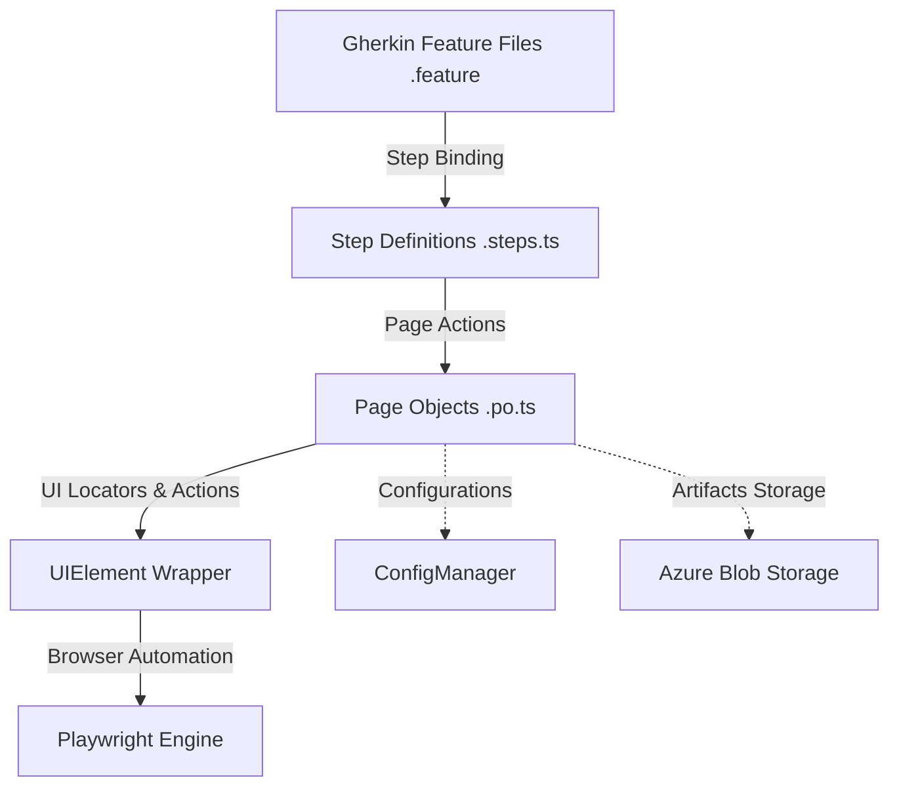

# Playwright BDD + POM Test Automation Framework

This is a professional-grade, layered test automation framework built with Playwright, Cucumber.js, and TypeScript. It implements industry best practices including the **Page Object Model (POM)** pattern, **Singleton configuration**, and a custom **UIElement locator wrapper** to ensure robust, flaky-resistant UI testing.

---

## Architecture

The framework is structured into five distinct layers:



1. **BDD Feature Files (`src/features/**/*.feature`)**: Human-readable Gherkin scenarios representing acceptance criteria.
2. **Step Definitions (`src/steps/**/*.steps.ts`)**: The glue layer matching Gherkin steps to code execution.
3. **Page Objects (`src/pages/**/*.po.ts`)**: Represents the UI interaction layer, encapsulating selectors and user flows.
4. **UIElement Wrapper (`src/utils/UIElement.ts`)**: An abstraction layer that wraps Playwright Locators to inject auto-retries, wait logic, and clean action logs.
5. **Infrastructure Layer (`src/config/`, `src/utils/`)**:
   - `ConfigManager.ts`: A Singleton class to load environment-specific configuration (`dev`, `staging`, `prod`) and allow overrides.
   - `BlobStorage.ts`: Azure Blob Storage utility to upload test artifacts (failed screenshots) and retrieve test files.

---

## Directory Structure

```text
├── .github/
│   └── workflows/
│       └── ci.yml                     # GitHub Actions CI workflow
├── src/
│   ├── config/
│   │   └── ConfigManager.ts          # Singleton environment configuration manager
│   ├── features/
│   │   └── login.feature              # Gherkin Scenario Feature File
│   ├── hooks/
│   │   └── hooks.ts                   # Cucumber Before/After hooks & custom World
│   ├── pages/
│   │   ├── BasePage.ts                # Base POM container
│   │   └── Login.po.ts                # Login Page Object
│   ├── steps/
│   │   └── login.steps.ts             # Step Definitions mapping file
│   ├── test-data/
│   │   ├── config.dev.json            # Development environment configs
│   │   ├── config.staging.json        # Staging environment configs
│   │   └── config.prod.json           # Production environment configs
│   └── utils/
│       ├── BlobStorage.ts             # Azure Blob Storage Manager
│       └── UIElement.ts               # Playwright Locator wrapper with retries
├── .dockerignore                      # Docker context ignore patterns
├── .env.example                       # Environment file template
├── .gitignore                         # Git files exclusion patterns
├── cucumber.js                        # Cucumber.js runner configuration
├── Dockerfile                         # Playwright container configuration
├── Jenkinsfile                        # Declarative Jenkins pipeline script
├── package.json                       # Dependencies & execution scripts
├── playwright.config.ts               # Multi-browser Playwright global configuration
└── tsconfig.json                      # Strict TypeScript compiler options
```

---

## Setup Instructions

### Prerequisites
- Node.js (version 18 or higher)
- npm (Node Package Manager)

### Installation
1. Clone the repository and navigate to the project root:
   ```bash
   npm install
   ```
2. Download Playwright-supported browsers and dependencies:
   ```bash
   npx playwright install --with-deps
   ```
3. Copy `.env.example` to `.env` and configure overrides if necessary:
   ```bash
   cp .env.example .env
   ```

---

## Running Tests

The environment configuration defaults to `dev`. You can switch environments by setting the `ENV` variable (`dev`, `staging`, `prod`).

### 1. Default Run (Development / Headless Mode)
Runs tests in headless mode (no browser window opens) using development configurations:
```bash
npm run test
```

### 2. Run in Headed Mode (Browser UI Visible)
To launch the headed browser window to see tests execute in real time:

* **Using the Headed NPM Script**:
  ```bash
  npm run test:headed
  ```
* **Setting the Environment Variable on-the-fly**:
  You can override the default configuration using the `HEADLESS` environment variable:
  * **PowerShell**:
    ```powershell
    $env:HEADLESS="false"; npm run test
    ```
  * **CMD**:
    ```cmd
    set HEADLESS=false && npm run test
    ```
* **Persistent Configuration**:
  Change `"headless": true` to `"headless": false` in [config.dev.json](file:///d:/githubclonerepo/PlaywrightBDD/Playwright-BDD-ProductionGrid/src/test-data/config.dev.json).

### 3. Running Specific Tags
To execute scenarios matching specific tags:

* **Through npm script (using the `--` argument forwarder)**:
  ```bash
  npm run test -- --tags "@heroku_004"
  ```
* **In headed mode with specific tags**:
  ```bash
  npm run test:headed -- --tags "@heroku_004"
  ```
* **Directly via npx**:
  ```bash
  npx cucumber-js --tags "@smoke"
  ```

### 4. Run in Specific Environments
Use the predefined npm scripts:
- **Staging (Firefox)**:
  ```bash
  npm run test:staging
  ```
- **Production (Webkit/Safari)**:
  ```bash
  npm run test:prod
  ```

### 5. Run in Parallel
To execute scenarios concurrently (e.g., with 3 parallel workers):
```bash
npx cucumber-js --parallel 3
```

---

## Reporting

After running tests, a self-contained, interactive HTML report is automatically saved to `test-results/cucumber-report.html`.

### How to Open the Report
- **Using npm script (Windows)**:
  ```bash
  npm run report
  ```

- **Direct OS-specific commands**:
  * **Windows**:
    ```bash
    start test-results/cucumber-report.html
    ```
  * **macOS**:
    ```bash
    open test-results/cucumber-report.html
    ```
  * **Linux**:
    ```bash
    xdg-open test-results/cucumber-report.html
    ```

---

## Docker Execution

To package the test suite and run containerized tests:

1. **Build the Docker Image**:
   ```bash
   docker build -t playwright-bdd-tests .
   ```

2. **Run the Container**:
   Pass environment overrides as environment parameters:
   ```bash
   docker run --rm -e ENV=staging -e BROWSER_NAME=firefox playwright-bdd-tests
   ```

---

## Azure Blob Storage Integration

When a test scenario fails, a screenshot is automatically captured, saved locally under `test-results/screenshots/`, and uploaded to the configured Azure Blob Storage container.

To configure Azure:
1. Obtain an Azure storage connection string.
2. Define the credentials in your `.env` file:
   ```env
   AZURE_STORAGE_CONNECTION_STRING="DefaultEndpointsProtocol=https;AccountName=..."
   AZURE_CONTAINER_NAME="test-screenshots"
   ```
If Azure configurations are left as defaults, the framework log warnings and safely skip cloud uploads to allow local-only executions.
